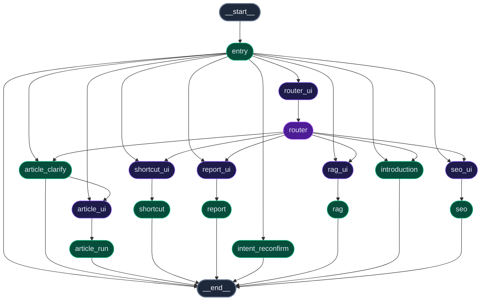

## cms-copilot

基于 **LangGraph** 的内容/站点运营 Copilot：把“意图识别 → 任务分流 → 工具调用（含 MCP）→ 结果输出”串成一张可在 **LangGraph Studio** 可视化调试的工作流图。

### 工作流架构图



### 你能用它做什么

- **RAG 问答**：支持 SSE 流式输入输出，提供“准备 + 生成”双阶段进度 UI 展示
- **文章任务**：进入文章相关 UI/节点，支持参数自动提取与多轮澄清，执行文章生成/处理类任务
- **SEO 规划**：进入 SEO 相关 UI/节点，基于 GA 数据输出 SEO 规划与建议
- **站点报告**：进入 report 子图，调用 GA MCP 工具生成可视化站点数据报告
- **快捷指令**：进入 shortcut 子图，用更“命令式”的方式完成常用动作，支持人工确认
- **MCP 工具接入**：支持 Model Context Protocol，可动态拉取工具并直接绑定到 LLM 或工作流中

### 关键入口

- **主图**：`src/agent/graph.py`（意图分流 + 子图/节点组装，包含 `rag_ui` 与 `rag` 节点拆分）
- **Studio UI**：`src/ui/index.tsx`（后端同仓 React 组件入口，组件文档见 `docs/ui-components.md`）
- **RAG 工具层**：`src/agent/tools/rag.py`（封装 SSE 调用与事件解析，支持流式与一次性结果）
- **MCP 客户端**：`src/agent/tools/mcp.py`（`MultiServerMCPClient`，动态 tools 加载）
- **LangGraph 配置**：`langgraph.json`（定义图结构、UI 组件映射与环境配置）

## 快速开始

### 1) 准备环境

- **Python**：>= 3.12.10
- **推荐工具**：`uv`（仓库包含 `uv.lock`）

### 2) 安装依赖

#### 方式 A：使用 uv（推荐）

```bash
uv sync --group dev
```

#### 方式 B：pip 可编辑安装

```bash
pip install -e . "langgraph-cli[inmem]"
```

### 3) 配置环境变量（强烈建议）

项目会从 `.env` 读取环境变量（见 `langgraph.json` 的 `"env": ".env"`）。请在项目根目录新建一个本地 `.env`（不要提交到仓库），至少配置下面这些（按你环境调整）：

```text
# LLM（建议覆盖默认值）
LLM_BASE_URL=
LLM_API_KEY=
LLM_MODEL=gpt-4.1-mini
LLM_NANO_MODEL=gpt-4.1-nano

# LangGraph Cloud（如需调用云端图/assistant 才配置）
LANGGRAPH_CLOUD_API_KEY=
ARTICLE_WORKFLOW_URL=
ARTICLE_ASSISTANT_ID=multiple_graph

# MCP Server（站点基础设置示例）
MCP_SITE_SETTING_BASIC_URL=
CMS_SITE_ID=
CMS_TENANT_ID=
MCP_DEBUG=0
```

说明：

- **不要依赖仓库内的默认 key/base_url**。请在本地或 CI 环境显式设置，避免误用或泄露。
- MCP 侧会自动在请求头注入 `X-Site-Id`（以及可选的 `X-Tenant-Id`），详见 `src/agent/tools/mcp.py`。

### 4) 启动本地 LangGraph Server（含 Studio）

```bash
langgraph dev
```

启动后即可在 LangGraph Studio 中打开并调试图（支持热更新、回放、编辑历史状态等）。

如果启动报错，可以尝试，关闭自动reload
```bash
langgraph dev --no-reload
```

## 目录结构（简版）

```text
src/
  agent/
    graph.py              # 主图组装（节点/边/子图）
    config.py             # 配置与环境变量入口
    nodes/                # 具体业务节点（entry/router/rag/article/seo/report/shortcut）
    subgraphs/            # 子图（report/shortcut）
    tools/                # 工具层（含 MCP 封装）
    utils/                # 通用工具（LLM/UI/HITL 等）
  ui/
    index.tsx             # Studio UI 入口
    components/           # 域组件 (router/rag/article/shortcut/seo/report)
    common/               # 通用组件
docs/
tests/
langgraph.json
```

## 前端项目
`https://agentchat.vercel.app/`
LangSmith Api Key填写.env中的LANGCHAIN_API_KEY即可

前端对接参数说明见：`docs/agent-chat-ui-params.md`

## 开发与测试

### 运行单测

```bash
pytest -q
```

### 代码质量（可选）

```bash
ruff check .
```

### Generative UI 与消息流
- **UI 更新**：通过 `push_ui_message` 结合 `merge=True` 更新卡片状态。
- **流式回答**：对于 RAG 等长文本输出，建议使用 `push_message(AIMessageChunk(...))` 走 `messages-tuple` 通道，以确保前端 SDK 能够实时逐 token 渲染回答，而不是被序列化为 `custom` 类型。

## 常见问题

### git status 提示 node_modules 路径不存在

这通常是历史产物或本地环境残留导致的告警，不影响 Python 侧运行；建议清理/重装前端依赖或删除异常的 node_modules 引用后再观察。

### 我想加一个新的意图/任务分支

- 在 `src/agent/nodes/` 新增节点（或在 `src/agent/subgraphs/` 新增子图）
- 在 `src/agent/graph.py`：
  - `builder.add_node(...)`
  - 在 router 的条件边里增加 intent → node 映射
  - 连接到 `END` 或下一步节点

## License

MIT（见 `LICENSE`）

