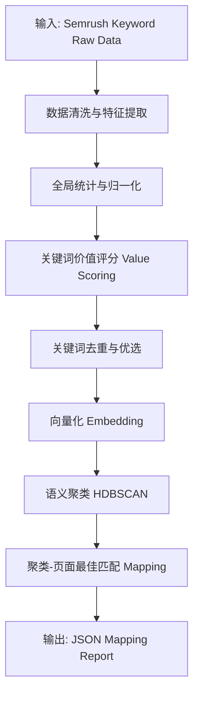

# 关键词智能聚类与着陆页映射算法技术规约

本文档旨在为开发人员详细阐述 SEO 关键词聚类与映射系统的算法细节，包括数学公式、数据流处理逻辑及核心参数配置。该系统基于 Semrush 多维数据，利用 Embedding 语义向量和 HDBSCAN 聚类算法，实现高价值关键词到网站页面的自动化精准匹配。

---

## 1. 数据处理流水线 (Pipeline)

系统处理流程严格遵循以下顺序：



---

## 2. 算法细节详解

### 2.1 关键词价值评分模型 (Value Scoring Model)

我们构建了一个线性加权模型来评估每个关键词的商业与流量价值。

#### 2.1.1 核心公式

$$
Score_{final} = \max\left(0, \sum (W_{pos} \cdot V_{norm}) - \sum (W_{neg} \cdot V_{norm})\right)
$$

其中 $V_{norm}$ 为归一化后的特征值，$W$ 为权重系数。

#### 2.1.2 特征处理与归一化逻辑

为消除不同量级（如搜索量 10 vs 1,000,000）的影响，对长尾分布字段采用 `Log1p + MinMax` 归一化。

对于任意特征 $x$，归一化公式为：

1.  **对数平滑**: $x' = \ln(1 + x)$
2.  **极值归一化**:
    $$
    V_{norm} = \frac{x' - \text{GlobalMin}(x')}{\text{GlobalMax}(x') - \text{GlobalMin}(x')}
    $$

*注：`GlobalMin` 和 `GlobalMax` 是基于当前批次所有关键词计算的全局统计量。*

#### 2.1.3 维度权重配置表

| 维度类别 | 字段 | 说明 | 预处理方式 | 权重系数 ($W$) |
| :--- | :--- | :--- | :--- | :--- |
| **正向指标** | `Nq` (搜索量) | 基础流量池大小 | Log1p + MinMax | **0.35** |
| | `Cp` (CPC) | 商业变现价值 | Log1p + MinMax | **0.20** |
| | `Td` (趋势) | 热度增长趋势 (见下文) | MinMax | **0.15** |
| | `In` (意图) | 转化意图强弱 (见下文) | 查表映射 | **0.10** |
| | `Fk` (SERP特性) | 结果页特征丰富度 | Count + MinMax | **0.05** |
| **负向指标** | `Co` (竞争度) | 广告竞争激烈程度 (0-1) | MinMax | **0.10** |
| | `Nr` (结果数) | 收录页面数量 | Log1p + MinMax | **0.03** |
| | `Kd` (难度) | SEO 难度 (0-100) | MinMax (0-100) | **0.02** |

#### 2.1.4 复合特征计算细节

**A. 趋势分 (Trend Score)**
Semrush 的 `Td` 字段通常包含过去 12 个月的热度值 $T_1, T_2, ..., T_{12}$。我们计算复合趋势分：

$$
V_{trend} = 0.5 \cdot \text{Avg}(T) + 0.35 \cdot \text{Ratio}_{last} + 0.15 \cdot \text{Slope}
$$

-   $\text{Avg}(T)$: 12个月平均热度（归一化后）
-   $\text{Ratio}_{last}$: $\min(\frac{T_{12}}{\text{Avg}(T)}, 2.0) / 2.0$ (最新月份能否超过平均水平)
-   $\text{Slope}$: 线性回归斜率 (反映增长势头)，归一化到 [0, 1]

**B. 意图分 (Intent Score)**
系统根据 Semrush 意图字段（0=Comm, 1=Info, 2=Nav, 3=Trans）赋予固定基础分：

-   **Transactional (3)**: 1.00 (最高优先级，直接转化)
-   **Commercial (0)**: 0.85 (高优先级，商业调研)
-   **Informational (1)**: 0.55 (中等，内容建设)
-   **Navigational (2)**: 0.20 (最低，通常已被品牌词占据)

---

### 2.2 语义聚类 (HDBSCAN Clustering)

我们抛弃了基于固定距离阈值的 DBSCAN，转向更稳健的 HDBSCAN 算法。

#### 2.2.1 向量化
-   **模型**: Azure OpenAI Embedding (`text-embedding-3-small` 或同等模型)
-   **预处理**: 对生成的 Embedding 向量 $\mathbf{e}$ 执行 L2 归一化：
    $$
    \mathbf{e}_{norm} = \frac{\mathbf{e}}{\|\mathbf{e}\|_2}
    $$

#### 2.2.3 聚类 ID 生成 (Stability)
为了确保跨批次运行的 ID 稳定性，便于落库追踪，系统使用 UUIDv5 标准生成 Cluster ID：
$$
\text{ClusterID} = \text{UUIDv5}(\text{NAMESPACE\_DNS}, \text{ClusterLabel})
$$
其中 `ClusterLabel` 为簇内 Top3 高价值关键词的拼接字符串。

---

### 2.3 页面映射决策逻辑 (Mapping Logic)

这是算法将“关键词簇”指派给“页面”的核心决策过程。

#### 2.3.1 预筛选：页面意图推断
系统首先根据 URL 规则和 Title 关键词，为每个页面打上预判意图标签（`pred_intent`）：
-   `/pricing` -> **Transactional**
-   `/blog/` -> **Informational**
-   `/about` -> **Navigational**
-   其他 -> **Commercial**

#### 2.3.2 匹配度计算公式
对于 聚类 $C$ 和 页面 $P$，计算综合匹配分：

$$
Score_{match}(C, P) = 0.65 \cdot Sim_{sem} + 0.25 \cdot Match_{intent} + 0.10 \cdot Hit_{lexical}
$$

1.  **Semantic Similarity ($Sim_{sem}$)**:
    $$
    Sim_{sem} = \cos(\mathbf{v}_{center}, \mathbf{v}_{page})
    $$
    其中 $\mathbf{v}_{center}$ 是簇内所有关键词向量的均值。

2.  **Intent Match ($Match_{intent}$)**:
    -   由 `intent_match_score` 函数计算。
    -   完全一致 (如 Info vs Info) 得 **1.0**。
    -   兼容意图 (如 Comm vs Trans) 得 **0.7**。
    -   冲突意图 (如 Nav vs Trans) 得 **0.2**。

3.  **Lexical Hit ($Hit_{lexical}$)**:
    -   检查簇中**主关键词 (Primary Keyword)** 的分词是否出现在页面 **Title** 或 **URL** 中。
    -   包含得 **0.1-0.2** 分，否则为 0。这确保了除了语义相关，字面上也要尽可能匹配。

#### 2.3.3 分配与冲突解决 (Assignment & Conflict Resolution)

系统按 **聚类价值分 (Cluster Value)** 从高到低遍历簇进行分配，允许一个页面承接多个簇，但须严格区分 **主/辅 (Primary/Secondary)** 角色：

**逻辑流程**:
1.  **Primary 抢占**:
    -   检查目标页面是否已有 `primary_keyword`。
    -   若**无**，或新簇的主词价值分 (Value Score) **高于** 现有主词：
        -   新簇主词 -> 成为页面 Primary。
        -   (若存在) 原主词 -> 降级为 Secondary。
        -   Mapping 标记: `role = "primary_owner"`。
    -   若**有**且价值分 **低于** 现有主词：
        -   新簇主词 -> 只能作为 Secondary。
        -   Mapping 标记: `role = "secondary_support"`。

2.  **Secondary 合并**:
    -   无论角色如何，簇内的非主关键词均合并入页面的 `secondary_keywords` 列表。
    -   列表按价值分降序排列并去重，保留 Top N。

这确保了：
-   **ID 稳定**: 下游系统可依赖 Hash ID。
-   **解释连贯**: `assignment_role` 字段明确告知用户该簇在页面内容策略中的定位。
-   **最优匹配**: 始终由价值最高的关键词占据页面的核心 H1/Title 优化位。

---

## 3. 输出数据结构 (JSON Schema)

算法最终输出包含四个核心字段的 JSON 报告。

### 3.1 核心字段概览

| 根字段 | 类型 | 说明 |
| :--- | :--- | :--- |
| `clusters` | List | **聚类档案**：所有生成的语义簇详情（ID、意图、包含词）。 |
| `mappings` | List | **优化指令** (原 Assignments)：簇到页面的具体指派动作与理由。 |
| `page_keyword_map` | List | **页面视图**：以页面为中心，汇总其最终获得的所有关键词 (Primary/Secondary)。 |
| `meta` | Object | **元数据**：算法运行参数与统计。 |

### 3.2 详细对象定义

#### Mapping Object (`mappings` 中的项)
```json
{
  "cluster_id": "UUID string (stable)",
  "target_page": {
    "page_id": "...",
    "url": "..."
  },
  "assignment_role": "primary_owner | secondary_support",
  "confidence": 0.85,  // 匹配置信度 (0-1)
  "reasons": {
    "semantic_similarity": 0.82,
    "intent": { "cluster": "commercial", "page": "commercial", "score": 1.0 },
    "lexical": { "title_hits": [], "url_hits": [] },
    "value_signals": { ... } // 价值分详情
  },
  "cluster_primary_keyword": { ... }, // 该簇的主词
  "secondary_keywords": [ ... ] 
}
```

#### Page View Object (`page_keyword_map` 中的项)
这是最适合落地到 CMS 的数据格式。
```json
{
  "page_id": "...",
  "primary_keyword": {
    "kw": "best keyword for H1",
    "value_score": 0.95
  },
  "secondary_keywords": [
    // 聚合了所有分配给该页面的簇中的关键词
    { "kw": "...", "value_score": 0.8 }
  ],
  "clusters": ["uuid1", "uuid2"] // 该页面承接的所有簇 ID
}
```
