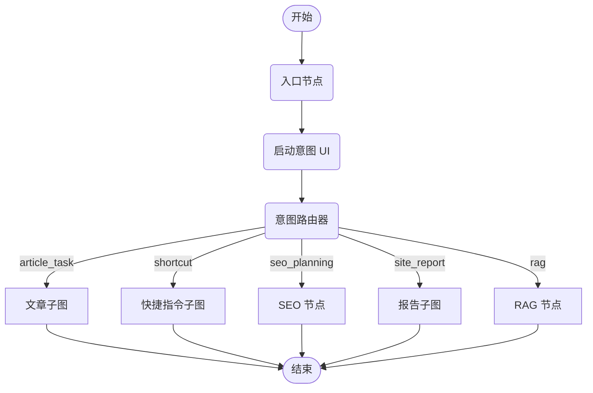

# CMS Copilot 项目概览

## 1. 项目目标
**CMS Copilot** 是一个基于 **LangGraph** 的内容和站点运营助手。它旨在通过自然语言简化内容管理工作流，允许用户执行诸如生成文章、规划 SEO、查看站点报告和执行快捷指令等任务。

## 2. 技术架构

### 核心技术栈
- **语言**: Python >= 3.12.10
- **编排**: LangGraph (StateGraph)
- **模型接口**: LangChain
- **工具协议**: Model Context Protocol (MCP) via `langchain-mcp-adapters`
- **依赖管理**: `uv`

### 架构图
系统遵循“路由器-子图”模式：

## 3. 核心组件

### 3.1. 代理图 (`src/agent/graph.py`)
定义 `StateGraph` 的主要入口点。它管理：
- **路由**: 根据用户意图决定执行哪个子图或节点。
- **状态**: 跨节点维护 `CopilotState`。
- **UI 集成**: 与 LangGraph Studio UI 协调。

### 3.2. 意图路由器 (`src/agent/nodes/router.py`)
- 使用 nano 级 LLM (如 `gpt-4.1-nano`) 将用户输入分类为以下意图：
    - `article_task`: 内容生成。
    - `shortcut`: 快速操作 (如更改 logo)。
    - `seo_planning`: SEO 任务。
    - `site_report`: 分析和报告。
    - `rag`: 通用问答 / 知识检索。
- 包含兜底规则 (关键词匹配) 以提高鲁棒性。

### 3.3. MCP 集成 (`src/agent/tools/mcp.py`)
- 连接到外部 MCP 服务器 (例如站点设置)。
- 自动将 MCP 工具转换为 LangChain 工具。
- 支持运行时动态工具发现。

### 3.4. UI & 前端
- **LangGraph Studio UI**: `src/ui/ui.tsx` 显式定义了 Studio 的交互式组件。
- **外部前端**: 存在一个单独的 Vercel 部署的前端 (`https://agentchat.vercel.app/`)。

## 4. 配置
配置遵循标准的 12-factor 应用模式，使用 `.env` 文件。
关键配置 (在 `src/agent/config.py` 中管理):
- `LLM_*`: 模型端点和密钥。
- `MCP_*`: MCP 服务器 URL。
- `ARTICLE_*`: 文章工作流的特定设置。

## 5. 目录结构
- `src/agent`: 代理的 Python 源代码。
    - `nodes/`: 单个图节点。
    - `subgraphs/`: 复杂的子工作流。
    - `tools/`: 工具定义和 MCP 客户端。
- `src/ui`: LangGraph Studio 的 TypeScript/React 代码。
- `tests`: 单元和集成测试。
