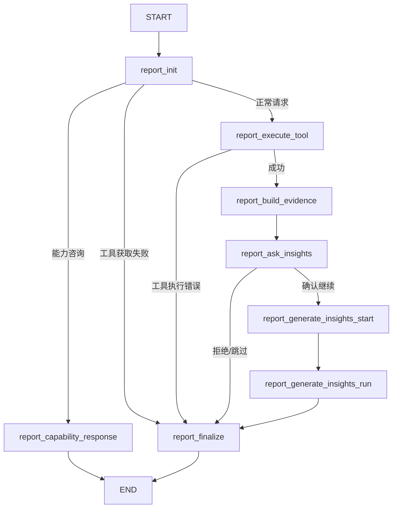

# Report 工作流分析

## 概述

`Report` 工作流旨在处理与站点分析相关的用户请求。它使用 ReAct 模式来规划和执行 Google Analytics (GA) MCP 工具调用，随后是可选的深度洞察生成阶段。

工作流定义在 `src/agent/subgraphs/report.py` 中，并在 `src/agent/nodes/report.py` 中实现。

## 工作流图

## 节点详情与 UI 交互

### 1. `report_init`

**功能：**
- 初始化报告工作流。
- 通过 `intent_router` UI 更新隐藏之前的“Thinking”卡片。
- 获取可用的 GA MCP 工具列表。
- 使用 LLM 对用户意图进行分类：`capability_inquiry`（能力咨询） vs `data_request`（数据请求）。

**UI 更新 (`push_ui_message`)：**
- **`report_progress`**：
    - `status: "loading"`, `step: "listing_tools"`："Listing tools from GA MCP..."（正在获取工具列表）
    - `status: "error"`, `step: "no_tools"`：如果工具获取失败。
    - `status: "loading"`, `step: "capability_response"`：如果意图是咨询。
    - `status: "loading"`, `step: "planning"`：如果意图是数据请求。

**State 更新：**
- `tool_specs`：可用工具列表。
- `is_capability_inquiry`：意图布尔标记。
- `property_id`：提取出的或默认的 GA property ID。

---

### 2. `report_capability_response`

**功能：**
- 处理“你能做什么？”类型的问题。
- 使用 LLM 生成可用报表和数据的用户友好摘要。

**UI 更新：**
- **`report_progress`**：
    - `status: "done"`, `step: "completed"`, `message`："Question answered."（已回答问题）

---

### 3. `report_execute_tool`

**功能：**
- **规划 (Planning)**：LLM 根据用户请求和工具 Schema 生成 JSON 计划，决定查询哪些 GA 图表/报表。
- **执行 (Execution)**：批量执行规划好的工具调用（如 `run_report`）。
- **处理 (Processing)**：
    - 归一化 GA 结果。
    - 根据数据维度生成特定图表（折线图、柱状图、饼图）。
    - 流式生成 LLM 对每个图表的分析文本。

**UI 更新：**
- **`report_progress`**：
    - `step: "fetching_data"`："AI is planning data fetching scheme..."（AI 正在规划数据获取方案）
    - `step: "plan_ready"`：列出即将获取的数据项。
    - `step: "completed"`："Charts generated."（图表已生成，随后立即隐藏）。
- **`chart_analysis_loading`**：
    - 为每个正在执行的工具调用显示“处理中...”卡片。
    - 当分析或图表生成完成时隐藏。
- **`chart_analysis`**：
    - 流式更新每个图表的文本分析。
    - `props`: `chart_title`, `chart_type`, `description`。
- **`report_charts`**：
    - 渲染实际的图表 UI 组件。
    - `props`: 包含 `charts` 数据的 `report` 对象。

**State 更新：**
- `tool_result`：包含 `charts`（图表）, `summary`（摘要）, `raws`（原始数据）, `final`（最终文本）。
- `tool_error`：如果执行失败（例如 auth 过期）。

---

### 4. `report_build_evidence`

**功能：**
- 从获取的工具结果构建 `EvidencePack`（证据包）。
- 这是生成洞察的准备步骤，将数据组织成 Insight Agent 可用的结构化格式。

**UI 更新：**
- 无直接更新（内部处理）。

**State 更新：**
- `evidence_pack`：结构化的证据数据。
- `data_quality`：数据质量指标/警告。

---

### 5. `report_ask_insights`

**功能：**
- 中断点 (HITL)。
- 询问用户是否继续进行深度洞察生成。

**UI 更新：**
- 触发浏览器中断（LangGraph interrupt）。

**State 更新：**
- `insights_confirmed`：用户选择的布尔结果。

---

### 6. `report_generate_insights_start`

**功能：**
- 准备洞察生成的 UI 状态。
- 如果需要（处理 resume 场景），重新回放（Re-hydrate）图表 UI。

**UI 更新：**
- **`report_charts`** & **`chart_analysis`**：重新推送之前的图表/分析卡片，确保它们可见。
- **`chart_analysis_loading`**：强制隐藏任何残留的加载卡片。
- **`report_progress_insights`**：
    - `status: "loading"`, `step: "generating_insights"`："Generating insights report..."（正在生成洞察报告）

---

### 7. `report_generate_insights_run`

**功能：**
- 调用 `generate_report_insights_streaming` 生成深度洞察、行动建议和待办事项。
- 将输出流式推送到 UI。

**UI 更新：**
- **`report_insights`**：
    - 洞察内容的流式更新。
    - `status: "loading" -> "done"`。
    - `props`: 包含 `insights`, `actions`, `todos` 的 `report` 对象。

**State 更新：**
- `insights`, `actions`, `todos`, `trace`, `step_outputs`：生成的洞察数据。

---

### 8. `report_finalize`

**功能：**
- 最终清理和状态设置。
- 确保所有相关 UI 组件处于最终的“完成”状态。

**UI 更新：**
- **`chart_analysis_loading`**：强制隐藏所有图表的加载卡。
- **`report_progress_insights`**：隐藏。
- **`report_insights`**：
    - `status: "done"`, `message`："Insights generated."（洞察已生成）

---

### 9. 图表生成逻辑 (`_build_chart_from_ga_report`)

`report_execute_tool` 调用 `_build_chart_from_ga_report` 将 GA 返回的原始数据转换为前端可渲染的图表配置。逻辑如下：

1.  **折线图 (Line Chart)**
    -   **触发条件**：第一维度名称包含 "date"（不区分大小写）。
    -   **用途**：展示时间趋势。
    -   **配置**：
        -   `chart_type`: `"line"`
        -   `x_key`: 维度名称（如 `date`）。
        -   `y_keys`: 所有指标名称列表。

2.  **饼图 (Pie Chart)**
    -   **触发条件**：同时满足以下三个条件：
        1.  仅查询了 1 个指标。
        2.  返回数据行数 <= 12。
        3.  第一维度属于“分布类维度”（`PIE_FRIENDLY_DIMS`）：
            -   `deviceCategory` (设备类别)
            -   `sessionDefaultChannelGroup` (渠道组)
            -   `country` (国家)
            -   `city` (城市)
            -   `region` (地区)
            -   `browser` (浏览器)
            -   `operatingSystem` (操作系统)
            -   `platform` (平台)
            -   `language` (语言)
    -   **用途**：展示占比分布。
    -   **配置**：
        -   `chart_type`: `"pie"`
        -   `data`: 转换为 `[{name: ..., value: ...}]` 格式。

3.  **柱状图 (Bar Chart)**
    -   **触发条件**：以上都不满足时的默认类型。
    -   **用途**：展示Top列表或对比（如 Top Pages）。
    -   **配置**：
        -   `chart_type`: `"bar"`
        -   `x_key`: 第一维度名称。
        -   `y_key`: 第一指标名称。

---

## UI 组件汇总

| 组件 Key | 用途 |
| :--- | :--- |
| `report_progress` | 整体工作流进度（规划 -> 获取 -> 完成）。 |
| `report_charts` | 渲染实际的数据可视化（柱状/折线/饼图）。 |
| `chart_analysis` | 显示在图表旁边的文本分析。 |
| `chart_analysis_loading` | MCP 调用期间的临时“处理中”指示器。 |
| `report_insights` | 最终的详细洞察/行动建议报告部分。 |
| `report_progress_insights` | 专门用于洞察生成阶段的进度条。 |
