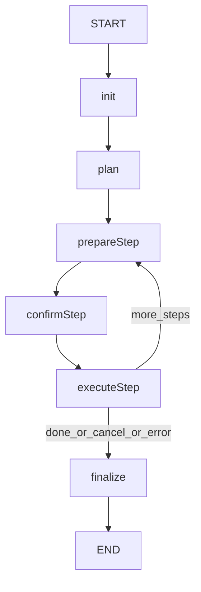

# Shortcut v2（Plan → Execute）实现说明

本文档描述本仓库中 **Shortcut 子图 v2** 的实现方式：将原先的“选择/确认/执行”旧流程重构为 **Plan →（按风险确认）→ 多步执行 → 汇总**，并在执行过程中 **逐步向前端推送每一步的结果**。

## 目标与原则

- **多步执行**：把一次用户请求拆解为多个 MCP 工具调用步骤（steps），按序执行。
- **按风险确认（risky_only）**：仅对可能产生写入/修改的步骤进行用户确认；只读步骤自动执行。
- **UI 统一**：整个流程只使用 `push_ui_message(name="mcp_workflow")` 更新同一张卡片（merge 同一个 UI id）。
- **逐步反馈**：每一步结束（成功/失败/跳过/取消）都会立刻 push 一次 UI 更新，前端可以实时看到进度与结果摘要。

## 代码位置

- **状态定义**：`src/agent/state.py`（`ShortcutState`）
- **节点实现**：`src/agent/nodes/shortcut.py`
- **子图编排**：`src/agent/subgraphs/shortcut.py`
- **（可选）本地 smoke**：`scripts/smoke_shortcut_v2.py`

## 数据流与节点流程

### 子图拓扑



### 节点职责（`src/agent/nodes/shortcut.py`）

- **`shortcut_init`**
  - 创建 `AIMessage` 作为 UI anchor（写入 `ui_anchor_id` / `ui_id`）。
  - 拉取可用 MCP tools（`get_mcp_tools`），写入 `tools`（轻量信息：`code/name/desc`）。
  - 初始化执行上下文：`plan_steps=[]/None`、`current_step_idx=0`、`step_outputs=[]`、`cancelled=False`。
  - 推送 UI：`status="loading" → "running"`。

- **`shortcut_plan`**
  - 调用 LLM（`llm_nostream.ainvoke`）基于 `tools + user_text` 生成计划：
    - 输出严格 JSON：`{"steps":[{"title","tool","args"}...]}`。
    - 解析失败会降级：尽量生成单步执行（fallback）。
  - 为每个 step 计算 `is_risky`（基于 tool code/description 的关键字匹配）。
  - 推送 UI：展示计划概要（每步标题/工具/是否需确认）。

- **`shortcut_prepare_step`**
  - 根据 `current_step_idx` 设置 `current_step`。
  - 推送 UI：当前准备执行第 N 步（标题/工具）。

- **`shortcut_confirm_step`**
  - 若 `current_step.is_risky` 为 **False**：直接写入 `pending_decision={"action":"approve"}`（无需 interrupt）。
  - 若 `is_risky` 为 **True**：调用 `interrupt(...)` 等待用户决策：
    - approve：批准执行
    - skip：跳过当前步
    - cancel：取消全部后续
  - 推送 UI：`status="confirm"`（提示该步可能修改数据）。

- **`shortcut_execute_step`**
  - 根据 `pending_decision.action` 执行：
    - **cancel**：写入 `cancelled=True`，并 push UI：`status="cancelled"`。
    - **skip**：记录 `step_outputs += {skipped:true}`，推进 idx，并 push UI（逐步反馈）。
    - **approve**：调用 `call_mcp_tool(tool_name, tool_input, tenant_id, site_id)`，记录结果到 `step_outputs`，推进 idx。
  - **逐步反馈关键点**：每一步完成后（成功/失败/跳过/取消）都会 push 一次 UI 更新（见下文）。

- **`shortcut_finalize`**
  - 汇总：完成数/跳过数/总步数，选择 `status=done/cancelled/error`。
  - push UI：写入汇总 message，并附带 `step_outputs`（便于前端展示详情或调试）。

## ShortcutState（`src/agent/state.py`）

与父图共享：
- `messages`: Annotated[Sequence[BaseMessage], add_messages]
- `ui`: Annotated[Sequence[AnyUIMessage], ui_message_reducer]
- `tenant_id`, `site_id`

v2 专属字段（核心）：
- **`user_text`**：用户原始请求文本（用于生成 plan）。
- **`tools`**：可用工具列表（轻量：`code/name/desc`）。
- **`plan_steps`**：计划步骤列表，元素结构（建议）：
  - `title`: str
  - `tool`: str
  - `args`: dict
  - `is_risky`: bool
- **`current_step_idx`**：当前执行到第几步（0-based）。
- **`current_step`**：当前 step dict。
- **`pending_decision`**：确认阶段产物：`{"action":"approve"|"skip"|"cancel"}`。
- **`step_outputs`**：逐步结果列表（每步一个 dict，见下文）。
- **`cancelled`**：是否取消。
- **`error`**：致命错误（用于 finalize 走 error）。
- **`ui_anchor_id/ui_id`**：复用 `mcp_workflow` 卡片的锚点与稳定 id。

## 前端可观察到的 UI 更新（mcp_workflow）

### UI props 约定

所有 UI 更新通过：
- `push_ui_message(name="mcp_workflow", props=..., id=ui_id, message=anchor_msg, merge=True)`

常用字段：
- `status`: `"loading" | "running" | "confirm" | "done" | "cancelled" | "error"`
- `title`: 一般为 `"后台操作"`
- `message`: 供用户阅读的摘要文本
- `last_step`: **单步结果摘要**（用于前端实时展示）
- `step_outputs`: **累计的每步结果列表**（可选，便于前端展开查看）

### 逐步反馈（每一步都会 push）

`shortcut_execute_step` 在以下情况会立即 push：
- 跳过：`last_step={idx,title,tool,skipped:true}`
- 取消：`last_step={idx,title,tool,cancelled:true}`
- 成功：`last_step={idx,title,tool,ok:true,duration_ms,message?}`
- 失败：`last_step={idx,title,tool,ok:false,duration_ms,error}`

同时会附带（可选但默认会带）：
- `step_outputs`: 累积数组（到当前为止）

> 注意：为了避免 UI payload 过大，成功路径只在 `last_step` 放摘要，不强制塞入完整 `result`。完整结果会留在 `step_outputs[].result` 中（若你不希望前端接收大对象，可在后续进一步裁剪/脱敏）。

## interrupt 载荷（确认）

确认仅在 `is_risky=True` 的步骤触发，载荷结构：

```json
{
  "question": "该步骤可能会修改数据：第 N/M 步「xxx」。请选择：",
  "options": [
    {"label": "批准并执行", "value": "approve"},
    {"label": "跳过此步", "value": "skip"},
    {"label": "取消全部", "value": "cancel"}
  ]
}
```

后端解析后写入：`pending_decision={"action": ...}`。

## 风险判定（risky_only）

每个 step 的 `is_risky` 由 `_risk_of_tool(code, desc)` 判定（关键字匹配）。包含以下关键词会被视为风险步骤：

- 英文：`set/update/save/delete/remove/create/patch/post/put/write`
- 中文：`更新/保存/删除/写入/修改/创建`

如需更精细（例如按 MCP schema、按 HTTP method、按工具元数据标记），可以替换 `_risk_of_tool` 的实现。

## 扩展建议

- **更强的 plan 校验**：对 `tool` 是否存在、`args` schema 是否匹配做更严格校验；不匹配时自动补全/提示。
- **失败后的重试/跳过**：在失败分支增加一次 `interrupt`，让用户选择“重试/跳过/取消”。（目前失败直接置 `error` 并 finalize）\n- **step_outputs 裁剪**：若 MCP result 过大，可仅保留 `message/summary`，把原始结果落盘或仅用于日志。\n- **并发/批量**：若 tools 支持并行，可扩展为并行 step（需要改变 StateGraph 结构）。\n\n## Smoke 脚本\n\n本仓库包含一个轻量 smoke：`scripts/smoke_shortcut_v2.py`。\n- 使用 mock 规避 `get_stream_writer` 的 runnable context 限制\n- 覆盖 approve/skip/cancel 三条路径\n\n---\n\n如需前端更精细地展示“每一步的详细结果”，建议直接基于 `step_outputs` 渲染一个可展开列表，并优先使用 `last_step` 做实时滚动更新。
