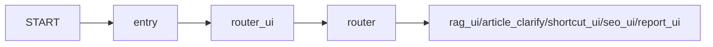
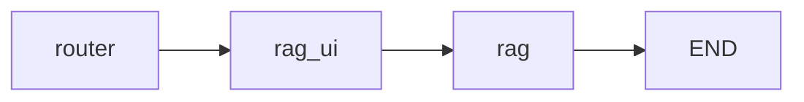
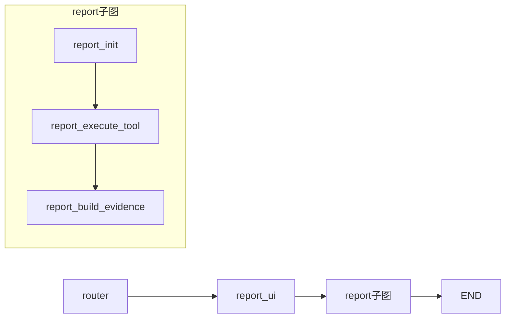
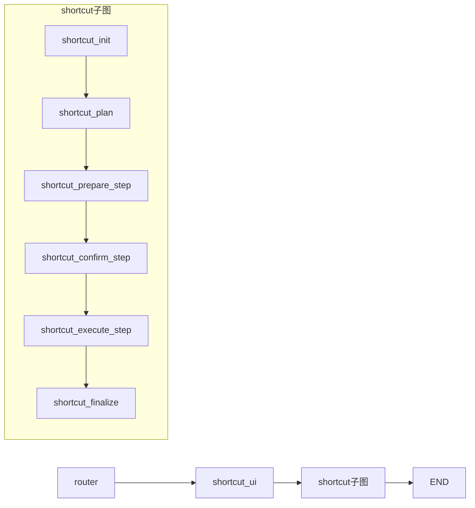
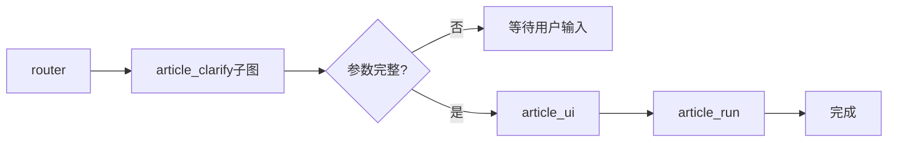
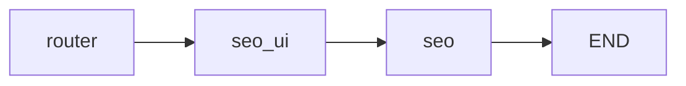

# CMS Copilot 工作流文档

本文档描述了项目中所有工作流的执行顺序、UI 组件输出和隐藏逻辑。

---

## 1. 路由工作流 (Router)

### 执行顺序



| 步骤 | 节点函数 | 描述 |
|-----|---------|------|
| 1 | `entry_node` | 入口节点，判断是否是 resume 流程 |
| 2 | `start_intent_ui` | 显示"正在识别意图"卡片 |
| 3 | `route_intent` | LLM 意图分类，决定路由目标 |

### 输出 UI

| UI 组件名 | Props 类型 | 状态 | 描述 |
|----------|-----------|------|------|
| `intent_router` | `IntentRouterProps` | `thinking` | 显示意图识别进度步骤 |
| `intent_router` | `IntentRouterProps` | `done` | 显示识别完成结果，包含 intent 和 route |

### 隐藏 UI

- **何时隐藏**: 进入下游工作流（shortcut/report/article/seo）时
- **隐藏方式**: `push_ui_message("intent_router", {"status": "done", "hidden": True}, merge=True)`
- **下游工作流负责隐藏**

---

## 2. RAG 工作流 (知识库查询)

### 执行顺序



| 步骤 | 节点函数 | 描述 |
|-----|---------|------|
| 1 | `start_rag_ui` | 初始化 session_id |
| 2 | `handle_rag` | 调用 RAG API 流式返回答案 |

### 输出 UI

RAG 工作流**不创建独立 UI 卡片**，而是复用 Router 的 `intent_router` 卡片：

| UI 组件名 | Props 更新 | 描述 |
|----------|-----------|------|
| `intent_router` | `rag_status: "running"` | 显示 RAG 进行中 |
| `intent_router` | `rag_status: "done"` | RAG 完成 |
| `intent_router` | `rag_status: "error"` | RAG 出错 |

### 隐藏 UI

- RAG 工作流**不隐藏** Router 卡片
- 卡片保持可见，显示 RAG 状态更新

---

## 3. Report 工作流 (站点报告)

### 执行顺序



| 步骤 | 节点函数 | 描述 |
|-----|---------|------|
| 1 | `start_report_ui` | 创建 UI 锚点和 ID |
| 2 | `report_init` | 拉取 GA MCP 工具、意图分类 |
| 3 | `report_execute_tool` | LLM 规划 + 批量执行 GA API |
| 4 | `report_build_evidence` | 生成 EvidencePack 和数据质量提示 |

### 输出 UI

| UI 组件名 | 描述 |
|----------|------|
| `report_progress` | 进度卡片（AI Planning → Data Fetching → Rendering Charts） |
| `report_charts` | 图表卡片（展示生成的图表） |
| `report_insights` | 洞察卡片（Key Insights、Actions、Todos） |
| `chart_analysis` | 单个图表的 LLM 分析结果 |
| `chart_analysis_loading` | 图表分析加载提示 |
| `report_confirm_insights` | 确认是否执行深度洞察分析 |
| `report_progress_insights` | 洞察阶段进度条 |

### 隐藏 UI

1. **隐藏 Router 卡片**: 在 `report_init` 中
   ```python
   push_ui_message("intent_router", {"status": "done", "hidden": True}, merge=True)
   ```

2. **隐藏图表加载提示**: 在图表分析内容开始输出时
   ```python
   push_ui_message("chart_analysis_loading", {"hidden": True}, merge=True)
   ```

---

## 4. Shortcut 工作流 (后台操作)

### 执行顺序



| 步骤 | 节点函数 | 描述 |
|-----|---------|------|
| 1 | `start_shortcut_ui` | 主图节点，初始化 mcp_workflow UI |
| 2 | `shortcut_init` | 拉取 MCP tools 列表 |
| 3 | `shortcut_plan` | LLM 意图分类 + 生成执行计划 |
| 4 | `shortcut_prepare_step` | 设置当前步骤，更新进度 |
| 5 | `shortcut_confirm_step` | 风险步骤确认（interrupt） |
| 6 | `shortcut_execute_step` | 执行当前步骤 |
| 7 | `shortcut_finalize` | 汇总展示结果 |

### 输出 UI

| UI 组件名 | 描述 |
|----------|------|
| `mcp_workflow` | 主工作流卡片，显示状态（loading/running/done/error） |
| `shortcut_select` | 选择操作（Generative UI） |
| `shortcut_confirm` | 确认执行（Generative UI） |

### 隐藏 UI

1. **隐藏 Router 卡片**: 在 `start_shortcut_ui` 中
   ```python
   push_ui_message("intent_router", {"status": "done", "hidden": True}, merge=True)
   ```

---

## 5. Article 工作流 (文章生成)

### 执行顺序



| 步骤 | 节点函数 | 描述 |
|-----|---------|------|
| 1 | `article_clarify_parse` | 解析用户输入，提取文章参数 |
| 2 | `article_clarify_ui` | 显示参数填写表单（如缺参） |
| 3 | `start_article_ui` | 显示文章生成进度卡片 |
| 4 | `handle_article` | 调用云端 Article Workflow |

### 输出 UI

| UI 组件名 | 描述 |
|----------|------|
| `intent_router` | "Thinking" 卡片（分析文章需求时） |
| `article_clarify` | 参数填写表单（App、Topic、Format、Audience、Tone） |
| `article_clarify_summary` | 参数确认摘要 |
| `article_workflow` | 文章生成进度卡片 |

### 隐藏 UI

1. **隐藏 Thinking 卡片**: 在 `article_clarify_ui` 和 `start_article_ui` 中
   ```python
   push_ui_message("intent_router", {"status": "done", "hidden": True}, merge=True)
   ```

---

## 6. SEO 工作流 (SEO 规划)

### 执行顺序



| 步骤 | 节点函数 | 描述 |
|-----|---------|------|
| 1 | `start_seo_ui` | 创建 SEO 规划 UI 锚点 |
| 2 | `handle_seo` | 获取 SEO 快照、LLM 生成周任务 |

### 输出 UI

| UI 组件名 | 描述 |
|----------|------|
| `seo_planner` | SEO 规划卡片（loading/done/error） |

### 隐藏 UI

- SEO 工作流**不主动隐藏** Router 卡片
- Router 卡片状态保持为 `done`

---

## UI 组件映射表 (ComponentMap)

前端 `ui.tsx` 中的组件映射：

```typescript
const ComponentMap = {
  intent_router: IntentRouterCard,
  rag_workflow: RAGWorkflowCard,
  article_workflow: ArticleWorkflowCard,
  article_clarify: ArticleClarifyCard,
  article_clarify_summary: ArticleClarifySummaryCard,
  mcp_workflow: MCPWorkflowCard,
  seo_planner: SEOPlannerCard,
  site_report: SiteReportCard,
  report_progress: ReportWorkflowCard,
  report_progress_insights: ReportWorkflowCard,
  report_charts: ReportChartsCard,
  chart_analysis: ChartAnalysisCard,
  chart_analysis_loading: ChartAnalysisLoadingCard,
  report_insights: ReportInsightsCard,
  report_confirm_insights: ReportConfirmInsightsCard,
  shortcut_select: ShortcutSelectCard,
  shortcut_confirm: ShortcutConfirmCard,
};
```

---

## 隐藏 UI 的通用模式

### 隐藏 IntentRouter 卡片

当下游工作流开始执行时，通常需要隐藏 Router 的 "Thinking Completed" 卡片：

```python
from langgraph.graph.ui import push_ui_message
from langgraph.config import get_stream_writer

intent_ui_id = state.get("intent_ui_id")
intent_anchor_id = state.get("intent_anchor_id")
intent_anchor_msg = find_ai_message_by_id(state, intent_anchor_id)
writer = get_stream_writer()

if intent_ui_id and intent_anchor_msg and writer:
    hide_msg = push_ui_message(
        "intent_router",
        {"status": "done", "hidden": True},
        id=intent_ui_id,
        message=intent_anchor_msg,
        merge=True
    )
    writer(hide_msg)
```

### 关键点

1. **`hidden: True`**: 前端根据该字段决定是否渲染 UI
2. **`merge: True`**: 合并到已有 UI 消息，而不是创建新的
3. **`id` 参数**: 必须使用原始 UI 消息的 ID
4. **`message` 参数**: 必须关联到正确的 AIMessage 锚点
